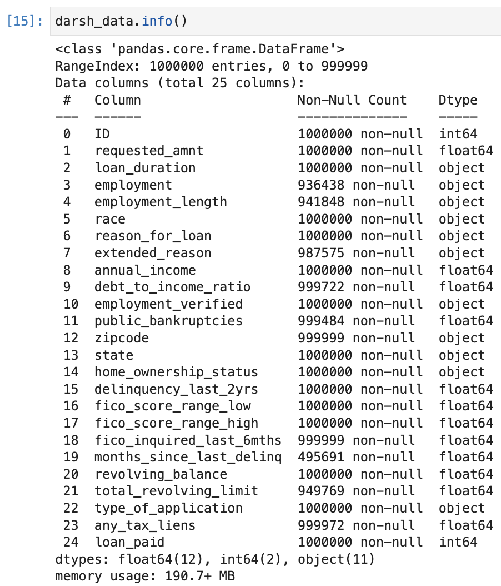

# Bank Lending Prediction Task 

For this prediction task, the goal was to predict whether or not a lender was going to pay off their loan given their financial information as well as some characteristics of their respective loans. Completed and submitted this project through Kaggle in a competition and placed 3rd in accuracy. Evaluated using Matthew's Correlation Coefficient. 

# Data
lending_train.csv (training)
  - training data csv 
  - 25 features with the last being 1 or 0 (if they paid their loan off or didn't)
  
  

lending_topredict.csv (testing)
  - Same features as training data
  - last column filled with question mark placeholders 
